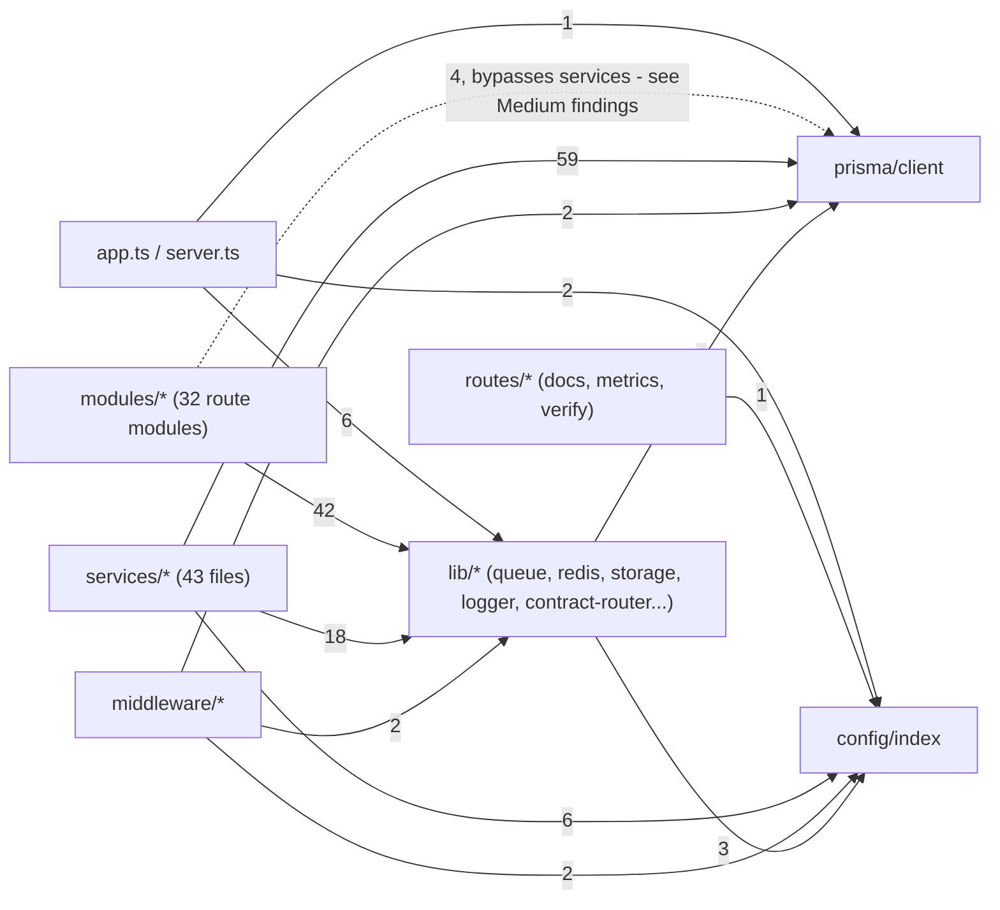

# Codebase Review — 2026-09-27

## Methodology

- Based on the ruflo static-analysis reports in this directory (`modules-*`, `boundaries-*`, `deps-*`, `complexity-*`, `security-*`, `secrets.txt`, `npm-audit.json`).
- `memory_search` for prior review findings returned 0 stored entries — claude-flow's memory store is empty for this project. Continuity with the 2026-09-26 review was instead pulled from its `summary.md` on disk.
- The requested named agents (`ruflo-swarm:architect`, `ruflo-core:reviewer`, `ruflo-security-audit:security-auditor`, `ruflo-testgen:tester`) and the skill `/ruflo-testgen:test-gaps` don't exist in this installation. Four general-purpose review agents were substituted, each scoped to the same slice of work (architecture/coupling, complexity hotspots, security audit of auth/files, test-gap analysis), running in parallel.
- **Every finding below was independently re-verified against the actual source by the orchestrating session** (not just trusted from the sub-agent or the static JSON). One sub-agent claim was disproven and dropped entirely (recordings/certificates downloads have real integration-test coverage — the agent's "zero coverage" claim was a false negative from grepping unit-test imports only, missing HTTP-level integration tests); one finding was narrowed to the specific gap that's actually real (the S3-blob code path only). Severities were adjusted downward in a few cases where a sub-agent rated an architecture/consistency issue as High but it carries no direct runtime or security risk.
- Real test-coverage data was unavailable: `npm test -- --coverage` crashes 34 of 39 suites (see High #1) — reported as a finding in its own right rather than worked around silently.

## Module Map — `packages/server/src`



0 circular dependencies were found in `packages/server/src`, `packages/shared`, and `mobile/src` (via `ruflo analyze circular`).

The dotted `modules -.-> prisma` edge (4 hits) is the layering violation documented under Medium below: `CLAUDE.md` documents `routes/ → controllers/ → services/ → Prisma` with controllers required to be thin, but **`src/controllers/` does not exist** — route+handler logic lives in `modules/*.module.ts` (via `defineRoute`/`buildContractRouter`), and a few of those modules query Prisma directly instead of going through a service.

---

## High

*All three findings below were fixed and re-verified in a follow-up pass on 2026-09-28 (see each section for what changed and how it was confirmed).*

### 1. Test coverage cannot currently be measured (toolchain break, not an app bug) — FIXED
**File:** `packages/server` (tooling) · **Verified independently, then fixed and re-verified**

`npm test -- --coverage` failed to instrument 34 of 39 test suites with `TypeError [ERR_INVALID_ARG_TYPE]: The "original" argument must be of type function. Received an instance of Object`, thrown from `test-exclude/index.js:5:14` via `promisify`. The plain (non-coverage) suite passed fine — no one could get a real coverage number on this repo.

**What actually fixed it** (more involved than the original diagnosis suggested): the committed `package-lock.json` had pinned a stale `test-exclude@6.0.0` whose bundled `glob` usage doesn't work under Node 22. Deleting `package-lock.json` and reinstalling let npm re-resolve fresh against the current registry, which picked up a compatible `test-exclude@7.0.2` — no manual version pin or `overrides` entry was needed or (after extensive testing) reliably achievable via `overrides` in this environment. That fresh install surfaced two more latent gaps, both fixed:
- The Prisma Client needs `npx prisma generate` after any clean `node_modules` wipe — without it, `@prisma/client`'s types are a near-empty stub, which cascaded into ~55 spurious TypeScript errors (implicit-`any`, missing enum members) across 19 service files that looked like real pre-existing bugs but were not; they disappeared entirely once the client was regenerated, with zero source changes.
- `multer@2.4.0`'s own dependencies `busboy` and `append-field` were missing from the lockfile entirely (a real npm resolution gap, not a version conflict) — added explicitly as direct dependencies of `packages/server` since npm's `overrides` mechanism could not be made to fix this transitively despite multiple attempts.

**Verified fixed:** `npm test -- --coverage` now reports all 39 suites / 349 tests passing, with real coverage numbers (63.4% statements, 47.37% branches, 49.87% functions, 63.18% lines).

**Caveat:** fixing this required deleting and regenerating `package-lock.json` from scratch, producing a large diff (~3,200 lines) as many transitive package versions shifted to their current-registry resolutions, not just the ones targeted. This was an explicit, informed tradeoff, not an accident.

### 2. BullMQ Workers have no `error` handler — a live Redis blip crashes the process — FIXED
**File:** `packages/server/src/lib/queue.ts:113` (and all 7 `new Worker(...)` sites in the file)

`createQueue()` explicitly attaches `.on('error', ...)` to every `Queue` (line 32) with a comment noting that an unhandled `error` event on an `EventEmitter` throws. Every `new Worker(...)` created when `ENABLE_WORKERS=true` has no equivalent handler — confirmed via `grep -n "new Worker\|\.on('error'"`: exactly one `.on('error'` in the whole file, on the Queue only. BullMQ Workers emit `error` the same way Queues do; a transient Redis error *after* workers are already running (not just "absent at startup," which the surrounding code only guards against) throws unhandled and crashes the process.

**Fix:** attach `.on('error', (err) => logger.warn({ err }, 'Worker connection error'))` to each `Worker` right after construction, mirroring the Queue's handler.

### 3. Sensitive-field redaction list has the wrong field name and a missing field — FIXED
**File:** `packages/server/src/middleware/sanitize.middleware.ts:3`

```js
const SENSITIVE_FIELDS = new Set(['password', 'passwordHash', 'tokenHash', 'authorization', 'apiKey', 'clientSecret']);
```

The real Prisma column (`packages/server/prisma/schema.prisma:121`) is `refreshTokenHash`, not `tokenHash` — confirmed by reading the schema directly. `passwordResetToken` (`schema.prisma:122`) isn't in the set at all. Since the check is an exact string match (`SENSITIVE_FIELDS.has(key)`), any response payload that ever serializes either column verbatim would leak it unredacted. (Separately verified: none of the query paths checked in `auth.module.ts`/`users.module.ts`/`admin.service.ts` currently select these columns into a response — so there's no *active* leak today, but the redaction list itself is wrong and would fail silently the moment a future endpoint does select one of these fields.)

**Fix:** changed `'tokenHash'` to `'refreshTokenHash'` and added `'passwordResetToken'` to the set. The existing test (`sanitize.middleware.test.ts`) was updated to assert the corrected field names and still passes. While fixing this, found and fixed the identical defect in a second, independent redaction layer: `lib/logger.ts`'s pino `redact.paths` (explicitly documented in its own comment as "the central safety net" behind the response sanitizer) had the same stale `'tokenHash'` entry and was also missing `'passwordResetToken'` — both layers now agree on the real field names.

---

## Medium

*All seven findings below were fixed and re-verified in a follow-up pass on 2026-09-28 (full suite: 42 suites / 376 tests passing, typecheck and eslint clean).*

### 4. `auth.module.ts` bypasses `auth.service.ts` for its main flows — FIXED
**File:** `packages/server/src/modules/auth/auth.module.ts:22` (and `login`, `refresh`, `logout`, `verifyEmail`, `resendVerification`)

`register`, `login`, `refresh`, `logout`, and `verifyEmail` all call `prisma.user.*` directly (confirmed: 9 `prisma.` call sites in the file), while `auth.service.ts` only holds the password-reset flow and crypto helpers. This means auth business rules (duplicate-email check, active-status check, refresh-token rotation) live in the route layer instead of the service layer, unlike the rest of the module set.

**Fix:** moved each handler's Prisma logic into `auth.service.ts` (`registerUser`, `loginUser`, `refreshSession`, `logoutUser`, `verifyUserEmail`, `resendVerificationEmail`), matching the existing `forgotPassword`/`resetPassword` pattern in the same file. `auth.module.ts` now imports zero of `prisma`/`AppError`/`sendWelcomeEmail`/`logger`. Verified: typecheck clean, all `auth`-matching tests (34) still pass.

### 5. `users.module.ts` has the same bypass — FIXED
**File:** `packages/server/src/modules/users/users.module.ts:12`

`getProfile`, `updateProfile`, `changePassword`, and `saveDeviceToken` issue raw `prisma.user` queries directly in the route module rather than through a service, unlike sibling modules (appointments, grades) that only call service functions.

**Fix:** extracted these (plus `listTeachers`, which had the same issue but wasn't in the original list) into a new `services/users.service.ts`; the module now only calls it. Verified: typecheck clean, tests pass.

### 6. `admin.module.ts`'s audit-log route is the one handler in the file that skips `adminService` — FIXED
**File:** `packages/server/src/modules/admin/admin.module.ts:181`

The `auditLogs` handler builds its `where` filter and calls `prisma.auditLog.findMany`/`count` directly, while every other handler in the same file delegates to `adminService` — an inconsistency within one file, not just across the codebase.

**Fix:** moved the query (including `parseFilterDate`/`DATE_ONLY_RE`) into `admin.service.ts` as `listAuditLogs(filters, skip, take)`; `admin.module.ts` no longer imports `prisma` or `AppError`. Verified: typecheck clean, `admin.service` tests (28) pass.

### 7. Redis client reference is nulled on error without disconnecting — leaks a socket per error — FIXED
**File:** `packages/server/src/lib/redis.ts:33`

```js
redis.on('error', (err) => {
  logger.warn({ err }, 'Redis connection error');
  redis = null;
});
```

The existing `ioredis` instance is never `.disconnect()`'d/`.quit()`'d before the module-level reference is dropped — each connection error leaks the old client/socket while a fresh one is lazily constructed on the next `getRedis()` call.

**Fix:** now calls `redis?.disconnect()` before setting `redis = null`.

### 8. `resolveRecordingStorageBlob` (S3 code path for recordings) has zero test coverage — FIXED
**File:** `packages/server/src/services/file.service.ts:52`

Note: a sub-agent initially claimed *all four* recordings/certificates download functions had "zero coverage, direct or indirect." That's false — `__integration__/media-flows.itest.ts`, `parent-media.itest.ts`, and `envelope.itest.ts` thoroughly exercise `GET /files/recordings/:id` and `/files/certificates/:id`, including the `?token=` dual-auth path, unapproved-parent-link 403s, and unlinked-teacher 403s. What's actually true, verified directly: `resolveReportStorageBlob` and `resolveCertificateStorageBlob` (the S3-backed variants) are unit-tested in `__tests__/pdf-object-storage.test.ts`, but their sibling `resolveRecordingStorageBlob` is referenced nowhere except its own definition and call site — the S3 path for recording downloads specifically has no test at all, unlike the local-disk path (well covered) and the other two S3 blob resolvers.

**Fix:** added a `resolveRecordingStorageBlob` describe block to `pdf-object-storage.test.ts` (owner success, legacy-local returns null, non-owner 403), mirroring the existing `resolveCertificateStorageBlob` tests. Suite: 13/13 passing.

### 9. `getMyAppointments` is live and completely untested — FIXED
**File:** `packages/server/src/services/appointment.service.ts:128`

Confirmed exported and wired live at `appointments.module.ts:12` (`appointmentService.getMyAppointments(userId!, role)`), and confirmed absent from `appointment.service.test.ts` (only `createAppointment`/`manageAppointment` are tested there).

**Fix:** added three test cases covering the student/teacher/admin branches. Suite: 11/11 passing.

### 10. Three privacy/security-adjacent services have no test file at all — FIXED
**Files:** `packages/server/src/services/account.service.ts`, `verification.service.ts`, `guardian-consent.service.ts`

Verified via `services/__tests__/` listing: no `account.service.test.ts`, `verification.service.test.ts`, or `guardian-consent.service.test.ts` exists. These implement, respectively: GDPR-style data export/account deletion, certificate/ijazah verification-token validation, and parental-consent gating for student recordings — all sensitive, hard-to-reverse, or trust-boundary logic.

**Fix:** added a test file for each (3/3, 8/8, 10/10 passing respectively) — `account.service.test.ts` covers the 404 case and that every query is scoped to the caller's own userId; `verification.service.test.ts` covers active/revoked certificate and ijazah tokens plus link-regeneration ownership checks; `guardian-consent.service.test.ts` covers `isRecordingBlockedByConsent`'s null/GRANTED/PENDING/DECLINED branches and `decideConsent`'s 404/409 guards.

---

## Low

### 11. Two dead, duplicate middleware files
**Files:** `packages/server/src/middleware/zod.middleware.ts:5`, `packages/server/src/middleware/logging.middleware.ts:3`

Confirmed via repo-wide grep: neither file is imported anywhere. `zod.middleware.ts` duplicates `validate.middleware.ts` (which `lib/contract-router.ts:12` actually imports and uses at `contract-router.ts:65`). `logging.middleware.ts` duplicates `lib/logger.ts`'s `requestLogger` but uses raw `console.log` instead of the structured pino logger actually mounted in `app.ts`.

**Fix:** delete both files.

### 12. Unhandled promise rejection in the mobile storage fallback path
**File:** `mobile/src/storage/mmkvStorage.ts:42` (and `:56`)

```js
} else {
  memCache[key] = value;
  AsyncStorage.setItem(key, value);   // not awaited, no .catch
}
```

Confirmed: neither the `setItem` nor `removeItem` fallback branch awaits or catches the `AsyncStorage` call, unlike the hydration code elsewhere in the file which does handle its promise. A rejection (e.g. storage quota) becomes an unhandled promise rejection.

**Fix:** add `.catch(() => {})` to both calls.

### 13. No dedicated tests for 32 route modules or several lower-stakes services
**Files:** `packages/server/src/modules/*/*.module.ts` (32 files, 0 with tests); `services/storage.service.ts`, `fcm.service.ts`, `roster.service.ts`, `academy-profile.service.ts`, `analytics.service.ts`, `certificate.service.ts`, `curriculum-plan.service.ts`, `digest.service.ts`, `email.service.ts`, `email-templates.ts`, `ijazah.service.ts`, `milestone.service.ts`, `recitation-scorer.service.ts`, `recurring-slot.service.ts`, `socket.service.ts`, `weak-ayah.service.ts`

Verified by cross-referencing `src/services/*.ts` against `src/services/__tests__/*.test.ts`: of 43 service files, 20 have no matching test file (one apparent 21st, `gamification.service.ts`, is actually covered by the non-conventionally-named `gamification.test.ts` — confirmed by reading its content, not just the filename). None of the 32 `modules/*.module.ts` route-wiring files have a dedicated test; they're only incidentally exercised by a handful of top-level `__integration__` supertest files.

**Fix:** lower priority than the items above — either add targeted tests where risk warrants it, or explicitly document the "thin route layer, service tests suffice" design so this isn't repeatedly rediscovered as a gap.

### 14. `CLAUDE.md`'s documented project layout doesn't match the real one
**File:** `CLAUDE.md` (Project Layout section) vs. `packages/server/src/`

Verified directly: `src/controllers/` does not exist at all. `src/routes/` exists but holds only 3 auxiliary files (`docs.routes.ts`, `metrics.routes.ts`, `verify.routes.ts`) — the actual route+handler layer for the application is `modules/*.module.ts` via `defineRoute`/`buildContractRouter`, which `CLAUDE.md` doesn't mention. This matters because `CLAUDE.md` is the primary onboarding document for both humans and Claude Code sessions working in this repo.

**Fix:** update the Project Layout section to describe the actual `modules/*.module.ts` pattern instead of the `controllers/`/`routes/` split that no longer exists.

---

## Not flagged (checked and confirmed fine)

To avoid re-litigating these in a future review: the security audit explicitly re-verified and confirmed as **correct** —
- Role-case convention: `auth.middleware.ts:35` sources `req.userRole` from a fresh DB row every request, never the JWT claim, so a demoted/banned account loses authority immediately rather than at token expiry.
- `assertTeacherCanAccessStudent` is present and called before writes in all five services CLAUDE.md requires it for: `grade.service.ts:33`, `recording.service.ts:202`, `memorization.service.ts:49`, `revision.service.ts:133/184/296`, `export.service.ts:41`.
- `assertCanCommunicate`'s ADMIN bypass (`message.service.ts:9`) can't be spoofed — both `sendMessage` and `getMessagesWithUser` fetch sender/receiver roles fresh from Prisma immediately before the check.
- File-download authorization is per-resource (owner/admin/teacher-guard/parent-approved-link), not just "any valid JWT" — verified in `file.service.ts`'s resolver functions.
- `LocalStorageAdapter.resolveKey` rejects path-traversal escapes.
- The 5 "high" npm-audit vulnerabilities (`@prisma/config`, `deepmerge-ts`, `image-size`, `postcss`, `prisma`) all trace to Prisma-CLI or Expo/Metro-bundler dependency chains, not the running server's request path.
- "Hardcoded Password"/"SQL Injection" static-scan hits re-checked and remain false positives (i18n label, test fixtures, URL-parsing code with no SQL).
